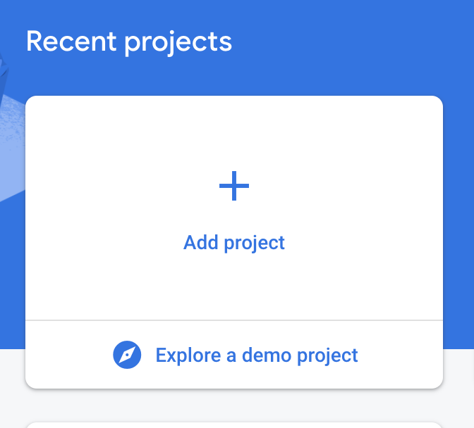
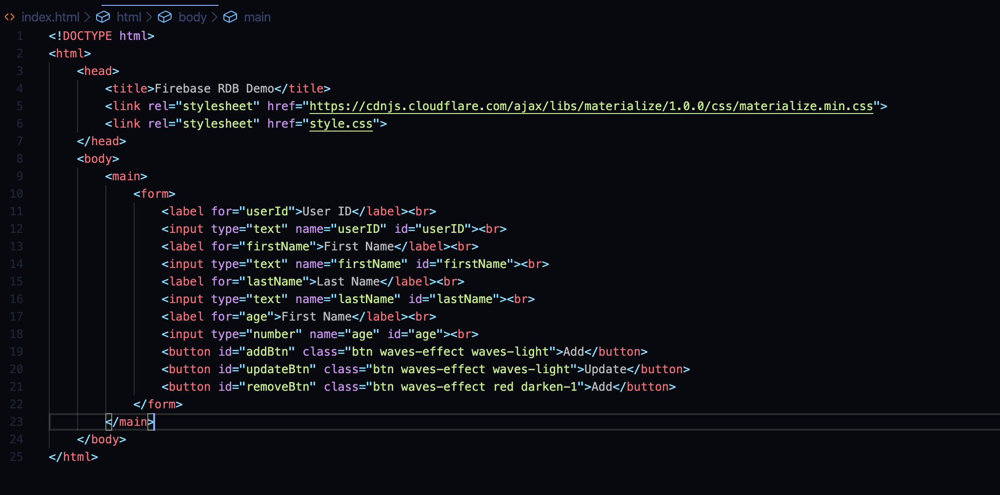
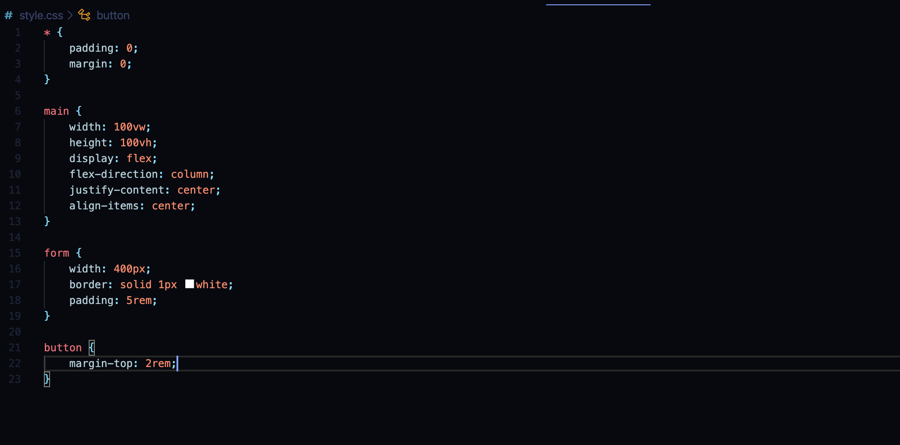
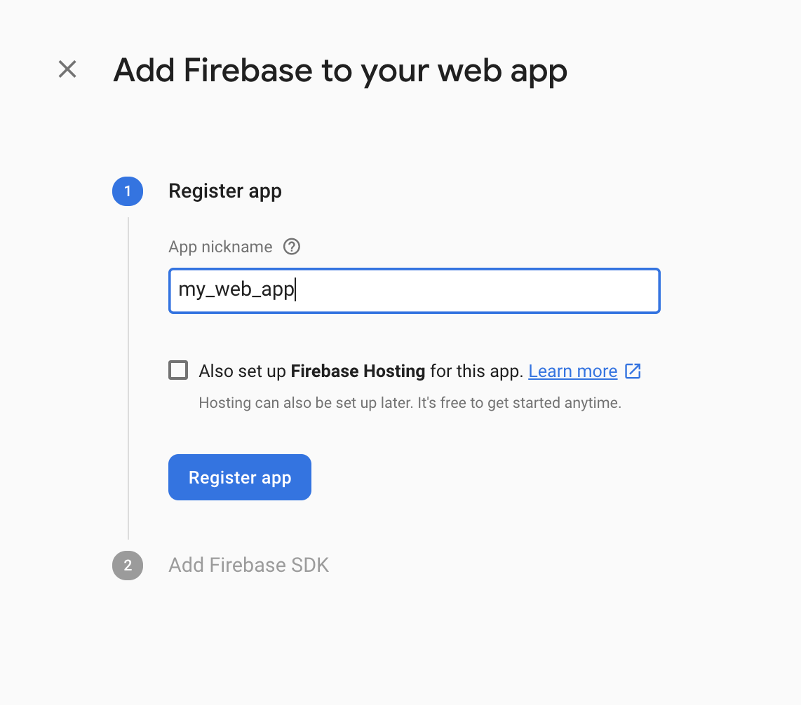
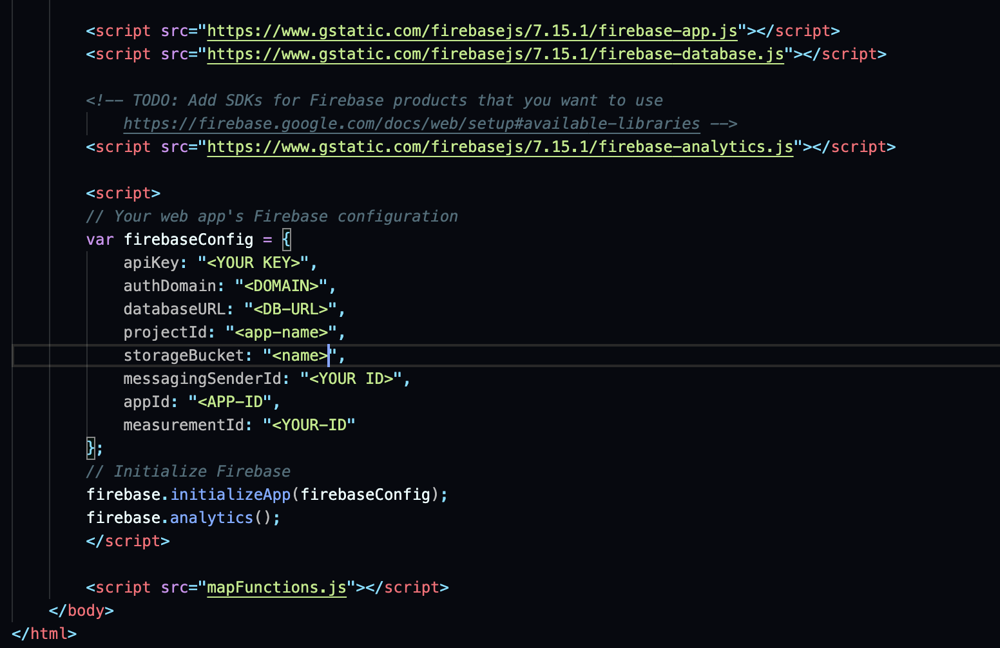
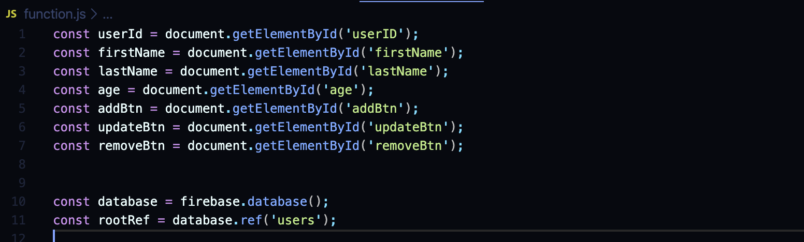
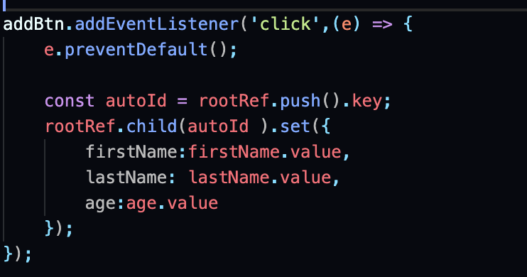
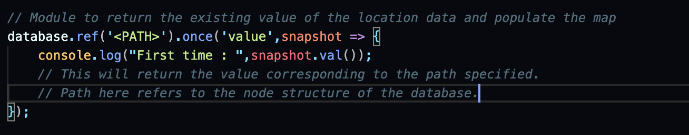
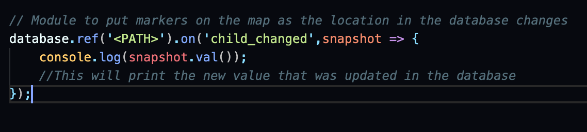

## Creating a project on the Firebase console
---

- Firstly , sign in to your Firebase [console](https://console.firebase.google.com/u/0/) using your google account.

- Then click on Add Project.

- Enter your project name.

- Click Continue until the project is initialized successfully.

Your Dashboard will look like this :

## Adding firebase dependecies to the boilerplate html file
---

Use the following boilerplate code to add the firebase dependencies :

- Now go to your project dashboard and click on web icon to initialize a web app.

- Follow the steps to initialize your web app.

- Now goto your created web app and click on the settings icon.

- At the bottom you will find JS code to initialize your web app with Firebase.

- Copy and paste it at the end of the <body> tag.

- Now create a new JS file and add the link to that file at the end of the above copied code.

- The JS file will look like this : 

## 1. Adding data to the database

We use the following code to add the data entered in the form created using html to the realtime database.

You can change the reference according to the node structure of your database.

## 2. Reading data from the database

### i) Reading it once

This method is executed when we load the webpage for the first time.

### ii) On change listeners

This method is invoked whenever a change happens in the node that is being listened.

These are all some of the functions that you can perform with Firebase using Javascript.

To know more about various functions , do explore the [documentation](https://firebase.google.com/docs?authuser=0) of Firebase.