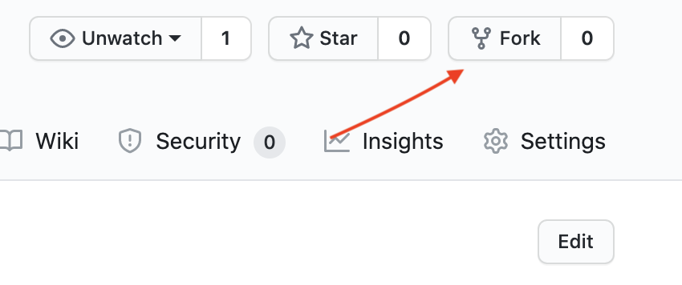
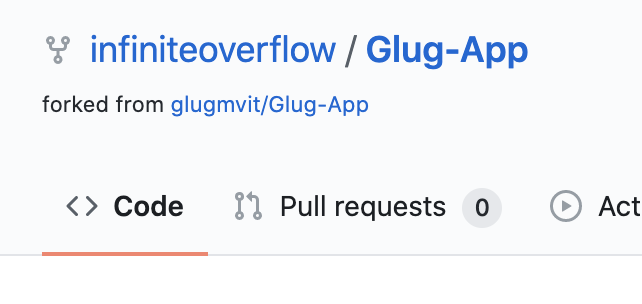

## Steps to Contribute Efficiently and without upsetting the Reviewers :P

- Checkout the official repository of Glug App on Github : https://github.com/glugmvit/Glug-App

- Next fork the repository , from the Fork option on the top right corner of the Repo page.



- Once thats done , you will have your own copy of the actual repository.



- Copy the link from the browser bar. It should be something like this : 

    https://github.com/infiniteoverflow/Glug-App

- Open Terminal (Linux and MacOS) or git bash terminal (Windows) and enter the following command :

    ```bash
    $ git clone https://github.com/<Your account name>/Glug-App

    $ cd Glug-App
    ```
- Then add upstream as follows :

    ```bash
    $ git remote add upstream https://github.com/glugmvit/Glug-App
    ```

- Check if upstream is added :

    ```bash
    $ git remote -v
    ```

- Make sure u get an output similar to the one below:

    ```bash
    origin	https://github.com/infiniteoverflow/Glug-App (fetch)
    origin	https://github.com/infiniteoverflow/Glug-App (push)
    upstream	https://github.com/glugmvit/Glug-App (fetch)
    upstream	https://github.com/glugmvit/Glug-App (push)
    ```

- Now create your own branch :

    ```bash
    $ git checkout -b <branch-name>
    ```

- Now open the app folder using VSCode/Android Studio/IntelliJ 

- Make sure you are on your created branch

- Make changes to the app files 

- Save everything

- Now come back to the terminal. Now its time you push your changes to your forked repository in your github account.

    ```bash
    $ git add <files-changed>
    $ git commit -m "<Mention the changes made>"
    $ git push origin <branch-name-your-created>
    ```

- Now open the forked repo on Github. Change to your created branch. Now you will see an option to Make a Pull Request.

- Click on that , and make sure you are making a Pull request to the Develop branch of the original repository , **NOT THE MASTER BRANCH !!**

- Once you make the PR , sit back and relax. Dont do any changes until your PR is merged or until you are asked to make changes.


### Steps to do before you start making any changes

You need to make sure your forked repo is even with the parent repo. To do that, perform the following steps every time you start working with the project.

```bash
$ git checkout master

$ git fetch upstream master

$ git pull upstream master

$ git push origin master
```
Then continue with creating your own branch and follow the steps after that, mentioned in **Steps to Contribute Efficiently and without upsetting the Reviewers :P**.

**One Suggestion :** If you are feeling confused about the steps , do let your team lead know about it !! He/She will help you out in that. 


