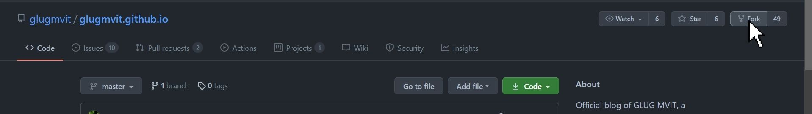
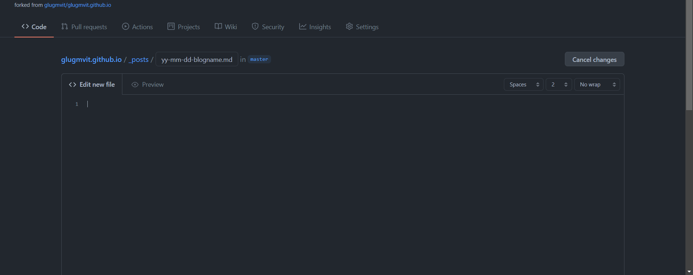
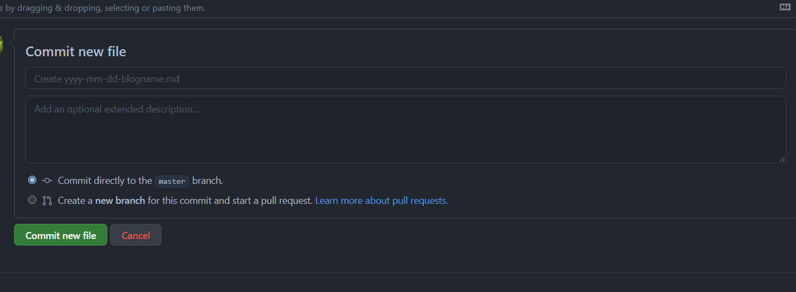
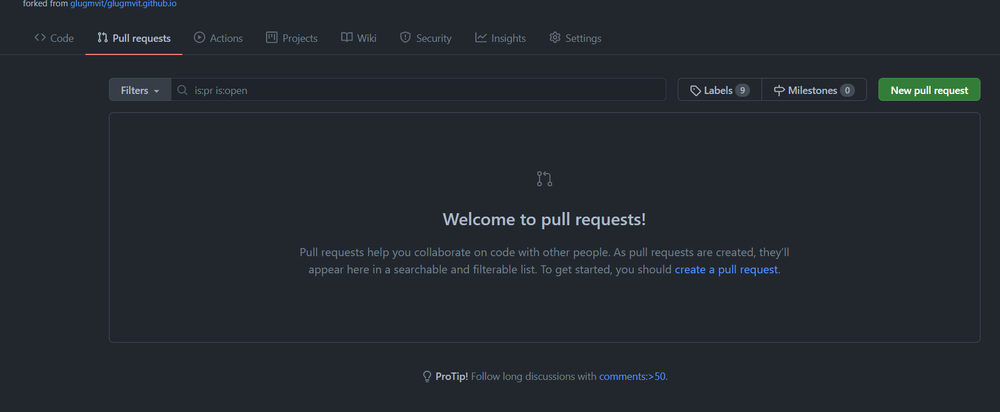
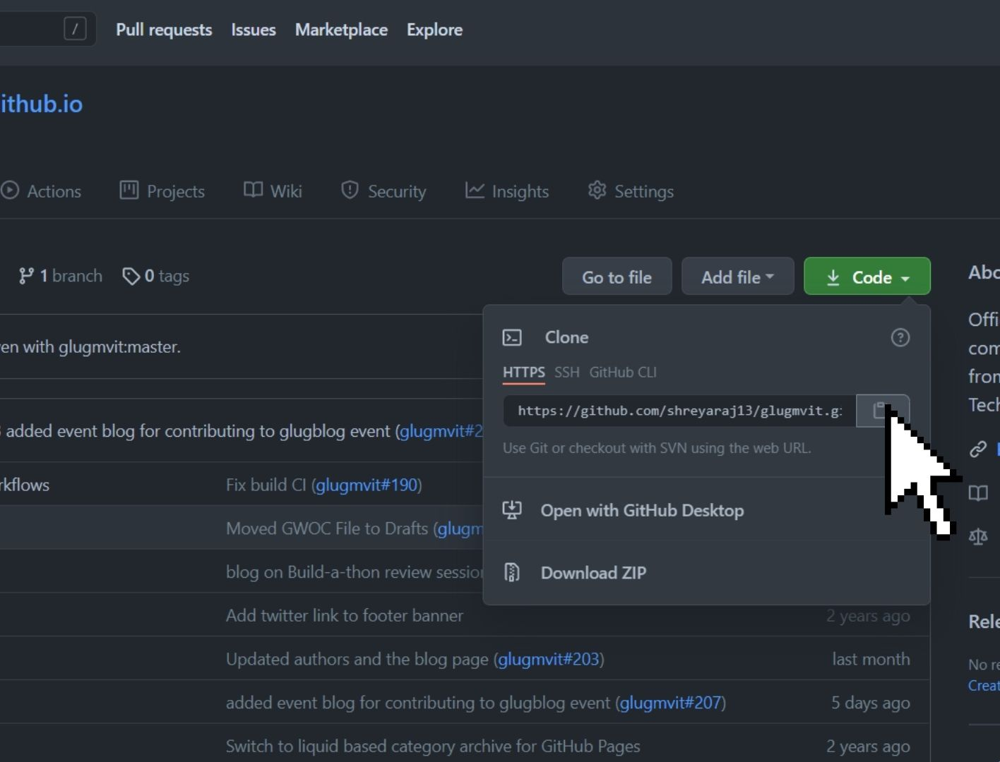

Writing technical blogs not only helps you share your technical expertise but also trains your brain to dig deeper and explain what you learned. We conducted a session on how can one contribute to the [GLUG Blog](https://blog.glugmvit.com/about) from scratch.

## Agenda

- Introduction to writing technical blogs.
- Steps to contribute to the GLUG Blog using **Github editor**.
- Steps to set up a local server.
- Steps to contribute to the GLUG blog using the **Local setup**.
- How can one add their author page.
- QnA

## Event Details

**Date:** 25th June 2021

**Time:** 4:30PM

**For any queries, join [CodeShack](https://t.me/codeshack)**

Or contact, Shreya: +917975496936, Kaushiki: +917261028129

## Prerequisite

**Enthusiasm** that's it. You don't need to have about any background knowledge about technical bloging.

## You can continue with the blog or watch this playlist on YouTube as well if you like

<iframe width="560" height="315" src="https://www.youtube.com/embed/videoseries?list=PLCcmelQJO_9bLIFK0Gvsji9uPpJfFKnjO" title="YouTube video player" frameborder="0" allow="accelerometer; autoplay; clipboard-write; encrypted-media; gyroscope; picture-in-picture" allowfullscreen></iframe>

**By following this tutorial you can contribute to any jekyll based blog website.**

## Contribute to the GLUG Blog using **Github editor** in 7 simple steps.

**This method is not recommended for beginners. Follow the method next to this if contributing for the first time.**

You need to create a **github** account to follow this tutorial.

**Step 1**: Visit [glugmvit.github.io](https://github.com/glugmvit/glugmvit.github.io) repository on github.

**Step 2**: Fork the repository.



**Step 3**: Add a new **markdown** file to the **\_posts** folder by clicking on **"Add file"** button on the right.

You will have **github editor** in front of you.



**Step 4**: Name it in this format **YYYY-MM-DD-blogname.md**

Refer to older blogs to add important contents for layout on the top which includes layout, title, author, categories, featured, image(banner) and excerpt.

**Step 5**: Now you can easily write your blog in **markdown** format. To learn **markdown** format [Click here](https://www.markdowntutorial.com/).

To add images to your blog create a new folder named after your blog in **assets/images** and add the images you wish to use in the blog. Then add images to your blog giving the image address as suggested by markdown format like

```

```

After finishing your blog move on to the next step.

**Step 6**: Scroll down and commit the changes with a commit message and a description.



After commiting the changes go back to your forked glugmvit.github.io repository. Your commit must be visible on the top.

**Step 7**: Now you need to create a pull request (to ask the main glugmvit.github.io repository to merge your changes in the code). Click the pull request button on the top.



Then click on **create a pull request**.

Then you could see the changes you have made in the repository. Next, add a pull request message and click on create pull request.

**Always make sure your branch is even with glugmvit:master. If not then fetch upstream and merge into your branch.**

**For detailed explaination about technical bloging, github and contributing through github editor, watch this youtube video.**

<iframe width="900" height="506" src="https://www.youtube.com/embed/JIdnVlHVZYo?list=PLCcmelQJO_9bLIFK0Gvsji9uPpJfFKnjO" title="YouTube video player" frameborder="0" allow="accelerometer; autoplay; clipboard-write; encrypted-media; gyroscope; picture-in-picture" allowfullscreen></iframe>

## Steps to contribute to the GLUG blog using the **Local setup**

**First two steps are same as the first method**

**Step 3**: Click on **Code** button and copy the URL.



**Step 4**: Open Terminal (Linux and MacOS) or git bash terminal (Windows) and enter the following command :

```bash
$ git clone https://github.com/<Your username>/glugmvit.github.io.git
```

This will make a copy of **yourusername/glugmvit.github.io** repository in your computer. Now navigate into that folder by

```bash
$ cd glugmvit.github.io
```

**Step 5 (one time setup)**: Setting up of local server.

- Install ruby into your system. [Click here](https://github.com/oneclick/rubyinstaller2/releases/download/RubyInstaller-2.6.7-1/rubyinstaller-devkit-2.6.7-1-x64.exe) to download ruby.
- Now install ruby by going with the default options.
- After installation, open terminal and run the following commands:

To install jekyll.

```ps
gem install jekyll bundler
```

Now check the version

```ps
jekyll -v
```

Now navigate to glugmvit.github.io folder and start the server by

```ps
bundle exec jekyll serve
```

in case you need to install necessary bundle, run

```ps
install bundle
```

then start the server by

```ps
bundle exec jekyll serve
```

Now you have the website running in your local server. Now whenever you need to start the surver just run the last command and you are good to go.

Now you can open your favorite code editor and starting working on your blog by following the same steps as **Step 4 and 5** of the previous method. You can simultaneously check your blog as change it in the local server website. Now you can view the blog as it might look in the main website so there is less room for mistakes.

**Step 6**: Add your author profile

- In **\_config.yml** file you will find details of all the authors. Add your detail in that file in same format as above mentioned authors.
- Add a new file in the **\_pages** folder named in the format **author-yourname.html**. Refer to previous author files, copy and paste the code into your author file and change the details into yours.
- Add the author profile picture in **assets/images/avatar** and name it same as your name.

Check the author profile in your local server website.

**Step 7**: Now you need to commit the changes you have made. Open git bash and navigate to glugmvit.github.io.

Add the changes by

```bash
$ git add .
```

This will add all your changes you have made in the code.

Now Commit the changes with a message by

```bash
$ git commit -m "your message"
```

**Step 8**: Now you need to push the changes in your repository.
Push the changes by

```bash
$ git push origin master
```

Now the changes you have made are pushed into your repository. Now you could see this new commit on the top.

Now you need to create the pull request by following **Step 7** of the previous method.

#### This is how you can easily contribute to the glug blog.

**Watch this video for detailed explaination of contributing to the GLUG blog using the Local setup**

<iframe width="900" height="506" src="https://www.youtube.com/embed/BZGVlqUFhks?list=PLCcmelQJO_9bLIFK0Gvsji9uPpJfFKnjO" title="YouTube video player" frameborder="0" allow="accelerometer; autoplay; clipboard-write; encrypted-media; gyroscope; picture-in-picture" allowfullscreen></iframe>

**Watch this video for introduction to Gitpod, QnA session and end notes.**

<iframe width="900" height="506" src="https://www.youtube.com/embed/ZFyFiK17L9w?list=PLCcmelQJO_9bLIFK0Gvsji9uPpJfFKnjO" title="YouTube video player" frameborder="0" allow="accelerometer; autoplay; clipboard-write; encrypted-media; gyroscope; picture-in-picture" allowfullscreen></iframe>
