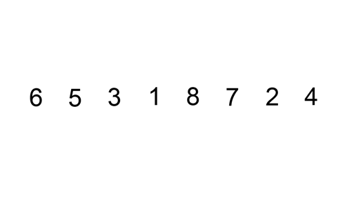
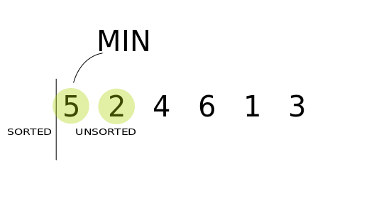

Sorting is a technique that is used to arrange the elements in some specific order. Sorting algorithms are the step wise instructions for sorting the list of elements.

### **Why do we use sorting algorithms ?** 
Sorting algorithms are used to keep the records in some order, further it would help other algorithms which uses the sorted data as input. Also the sorted list/data is more convenient for both humans and machines to extract the required record.
    For example the algorithm Binary Search requires the sorted list of items as input.

There are many type of sorting techniques having different time and space complexity.
Following are some important Sorting Algorithms :
* Bubble Sort
* Insertion Sort
* Selection Sort
* Merge Sort
* Quick Sort 
* Heap Sort


## **Bubble Sort**
Bubble sort is an algorithm to sort the list of given elements. It compares all the elements one by one based on their values.
In each iteration the smaller value is placed in beginning of the list, as the bubbles in the water comes up to the surface. Hence it is know as Bubble sort.
Sorting takes place by stepping through all the data items one by one in pairs and comparing adjacent data items and swapping each pair that is out of order.


```c
    int arr[] = {6,5,3,1,8,7,2,4}, n=8, i, j, temp;

	for(i=0;i<5;i++){
		for(j=i+1;j<5;j++){
			if(arr[i]>arr[j]){      //swap the elements
				temp = arr[i];
				arr[i] = arr[j];
				arr[j] = temp;
			}
		}
	}
```


### Complexity analysis of Bubble Sorting

In Bubble Sort, n-1 comparisons will be done in 1st pass, n-2 in 2nd pass, n-3 in 3rd pass and so on. So the total      number of comparisons will be   
> **(n-1)+(n-2)+(n-3)+.....+2+1  
  sum = n(n-1)/2**

Hence the complexity of Bubble Sort is O(n<sup>2</sup>).
The main advantage of Bubble Sort is the simplicity of the algorithm.Space complexity for Bubble Sort is O(1), because only single additional memory space is required for temp variable

Best-case Time Complexity will be O(n), it is when the list is already sorted.
    


## **Insertion Sort**

Insertion Sort is a technique in which an element is selected and placed in its corret position one by one.
We make the given list of elements into sorted and unsorted part. Initially the first element is considered to be sorted.Each element form the unsorted part from left to right is compared with the sorted part and the element is placed in the ordered position.

```c
    int arr[] = {6,5,3,1,8,7,2,4}, n=8, i, key, j;

	for(i=1; i<n; i++){
		key = arr[i];
		j = i - 1;
		while(j >= 0 && arr[j] > key){
			arr[j+1] = arr[j];
			j = j - 1;
		}
		arr[j+1] = key;
	}
```



### Complexity analysis of Insertion Sorting
In Insertion Sort , 0 comparisons are made for first element, 1 comparison is made for second element and so on.

> 1 + 2 + ..... + (n-1) = O(n<sup>2</sup>)

##### Big O: best = O(n), worst = O(n<sup>2</sup>), space : O(1)


## **Selection Sort**
In this sorting algorithm we choose the smallest element in the given list and place it in the first place.

Again we select the smallest element of the list except the first element and place it in the second place. 
Similarlly we select the minimum element and arrange them in the order. So it is known as Selection Sort.


```c
    int arr[] = {5,2,4,6,1,3}, n=6, i, min, j, temp;

	for(i = 0; i < n-1; i++){
		min = i;
		for(j= i+1; j < n; j++)
			if(arr[j] < arr[min])
				min = j;
		temp = arr[min];
		arr[min] = arr[i];
		arr[i] = temp;
	}
```


### Complexity analysis of Selection Sorting
Selection sort is inefficient on large lists, and generally performs worse than the similar insertion sort. It has performance advantages over more complicated algorithms in certain situations. It does no more than n swaps, and thus is useful where swapping is very expensive.

##### Big O: best/worst = O(n²), space : O(1)


## **Merge Sort**
Merge Sort follows Divide and Conquer rule.In merge sort the unsorted list is divided into N sublists, each having one element, because a list of one element is considered sorted. Then, it repeatedly merge these sublists, to produce new sorted sublists, and at lasts one sorted list is produced.

Merge Sort is quite fast, and has a time complexity of O(n log n). It is also a stable sort, which means the “equal” elements are ordered in the same order in the sorted list.


```c
int arr = {6,5,3,1,8,7,2,4};

void mergesort(int arr[], int p, int r){
  int q;
  if(p < r){
      q = floor( (p+r) / 2);
      mergesort(arr, p, q);
      mergesort(arr, q+1, r);
      merge(arr, p, q, r);
  }
}

void merge(int arr[], int p, int q, int r){
    int b[8],i, j, k;  //same size of arr[]
    k = 0;
    i = p;
    j = q+1;
    while(i <= q && j <= r){
        if(arr[i] < arr[j])
            b[k++] = arr[i++];       // same as b[k]=arr[i]; k++; i++;
        else
            b[k++] = arr[j++];
    }

    while(i <= q)
       b[k++] = arr[i++];

    while(j = p; i--) 
    arr[i] = b[--k];        // copying back the sorted list to a[]
}
```


### Complexity analysis of Merge Sorting
Time complexity of Merge Sort is O(n Log n) in all 3 cases (worst, average and best) as merge sort always divides the array in two halves and take linear time to merge two halves. It requires equal amount of additional space as the unsorted list. Hence its not at all recommended for searching large unsorted lists.
It is the best Sorting technique for sorting Linked Lists.

##### Big O: best/worst = O(nlogn), space : O(n)


## **Quick Sort**
Quick Sort algorithm also follows the Divide and Conquer rule as Merge Sort. But it is more complex and much faster than Merge sort and rarely reaches its worst case O(n<sup>2</sup>).
It has 3 basic steps:

* Select an element that is designated as the pivot from the array.
* Move smaller elements to the left of the pivot and larger elements to the right of the pivot.
* Using recursion apply steps 1 and 2 to the subsequent sub arrays.


```c
int partition(int arr[],int low,int high)
{
    int pivot = arr[high];  
    int temp;
    int  i = (low - 1);
    for (int j = low; j <= high- 1; j++)
    {
        if (arr[j] < pivot)
        {
            i++;    
            temp = arr[i];
            arr[i] = arr[j];
            arr[j] = temp;               
        }
    }
    temp = arr[i+1];
    arr[i+1] = arr[high];
    arr[high] = temp;                            
    return (i + 1);
}

void quickSort(int arr[],int low,int high)
{
    int pi;
    if (low < high)
    {
        pi = partition(arr, low, high);
        quickSort(arr, low, pi - 1);  
        quickSort(arr, pi + 1, high); 
    }
}
```


### Complexity analysis of Quick Sorting
The main thing about quick sort is that its worst-case performance is O(N²) which occurs when choosing the first or last element as the pivot. The most important issue in quick sort is thus choosing a good pivot element. This problem has more or less been solved by using the median strategy that guides the performance towards the O(N log N) complexity.

##### Big O: best = O(nlog n), worst = O(n<sup>2</sup>), space : O(log n)

## **Heap Sort**
Heap sort algorithm works using heaps. The max heap is used to select the largest number and placed accordingly. Again we have to rebuild the heap(heapify) and find for next largest element. This process continues till the whole list is sorted. Heap sort is not stable sort.

```c
void heapsort(int a[], int length)
{
    buildheap(a, length);
    int heapsize, i, temp;
    heapsize = length - 1;
    for( i=heapsize; i >= 0; i--)
    {
        temp = a[0];
        a[0] = a[heapsize];
        a[heapsize] = temp;
        heapsize--;
        satisfyheap(a, 0, heapsize);
    }    
}

void buildheap(int a[], int length)
{
    int i, heapsize;
    heapsize = length - 1;
    for( i=(length/2); i >= 0; i--)
        satisfyheap(a, i, heapsize); 
}

void satisfyheap(int a[], int i, int heapsize)
{
    int l, r, largest, temp;
    l = 2*i;
    r = 2*i + 1;
    if(l <= heapsize && a[l] > a[i])
        largest = l;
    else
        largest = i;
    if( r <= heapsize && a[r] > a[largest])
        largest = r;
    if(largest != i)
    {
        temp = a[i];
        a[i] = a[largest];
        a[largest] = temp;
        satisfyheap(a, largest, heapsize);
    }
}
```


### Complexity analysis of Heap Sorting
Using the heap, finding the next largest element takes O(log N) time, instead of O(N) for a linear scan as in simple selection sort. This allows heap sort to run in O(N log N) time, and this is also the worst case complexity.

##### Big O: O(nlog n), space : O(1)


Every Sorting Algorithm have its own significance. So we must select the sorting algorithm according to the requirement of the data we have. The suitable sorting algorithm is the one that takes less time and space for the given set of data items. We can save lots of time and memory by selecting the correct algorithm.
