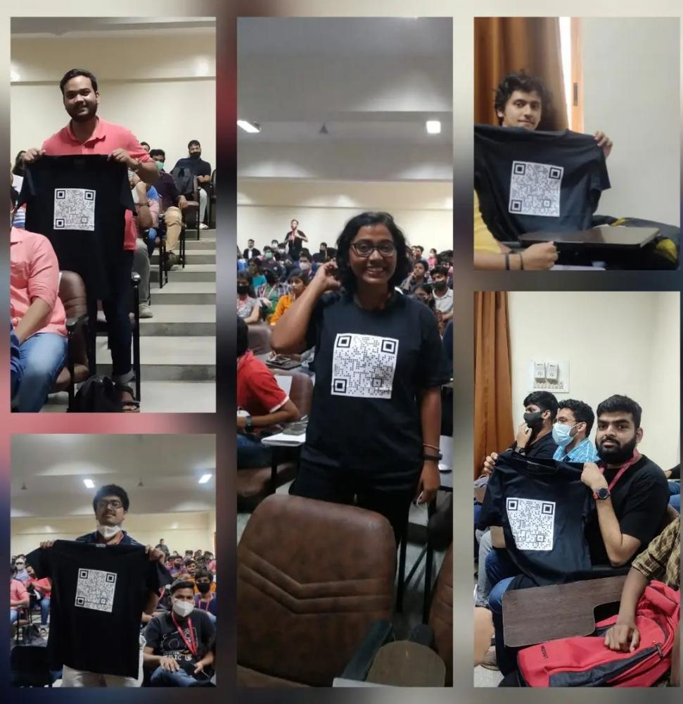

### Hey Folks!!

### Welcome to OP_HALLOWEEN21 BITCOIN DEV MEET-UP!!

Here we are to give you outlook about Bitcoin and it's related trends.
We are organizing this meet-up in which we will be first having hands on session on Git and Github followed by another small hands on session on Azure services and few MS products and then following the main session on Bitcoin Development and Open source contributions.
Feel free to join the meet-up and encourage your friends the same.
_LEARN SOMETHING NEW!EXPLORE!SHARE!REPEAT!_

#### Register for the event [Here](https://bit.ly/OP_Halloween21_BitcoinDev)

## OP_HALLOWEEN21 BITCOIN DEV MEET-UP

### Agenda

- Small hands on session on Git and Github.
- Small hands on session on Azure services and few MS products.
- Session on Bitcoin development and open source contributions.
- Any announcements, feedback, QnA.

## Event Details

This is very beginner-friendly event which help you to know more about Bitcoin Development and open source contributions and guide you further in your interest.

- **Date**:26th October 2021
- **Time**:1:30pm
  **For any queries contact,** Shreya:7975496936, Kaushiki: 7261028129

## Teacher coordinators:

- **Head of the Department:**
  Dr. G C Bhanuprakash
- Dr. Suma Swamy - Professor

## Student coordinators:

- Shreya Raj, CSE-III year
- Kaushiki Krity, ISE-III year
- Jyotsna A Patel, CSE-III year
- Anushka Aman, CSE-III year
- Pabbathi Jahnavi, CSE-III year
- Tadikonda Harshitha, CSE-III year
- Shubhani Mulay, ISE-III year

## The event was held as follows:

# Git and Github

speaker: Kaushiki Krity , c++, oop,open source contributor

### About Git:

From kaushiki's words it's clearly understood that Git is a VCS abbreviated as version control system which means that it helps us in managing project files.The primary reason behind it's existance is to keep track of the entire history of things that we are working on.

### About Github:

It is a web based service for version control using Git.It is basically a social networking site for developers.Other people's code can be seen and issues with the code can be identified and even changes can be proposed which helps in improving the code.It can be better understood as a place where one can show off their projects and get noticed by potential recruiters.

Git and GitHub are almost similar with slight changes which can be better understood by understanding the differences between them.

Git is a local VCS software that enables developers to save snapshots of their projects over time.It's generally best for individual use.whereas GitHub is a web-based platform that incorporates Git's version control features so they can be used collaborately.It also includes project and team management features as well as oppurtunities for networking and social coding.

Git is a command-line tool whereas Github is a graphical user interface

Git has no user management feature whereas GitHub has built-in user management feature

Git is maintained by linux whereas Github is maintained by Microsoft.

She ended her presentation with another intersting concept,OSS

### Open source software

Oss or open source software is a code that is designed to be publicly accessible which means that anyone can see,modify and distribute the code as they see and fit it.
Open source movement uses the values and decentralized production model of open source software to find new ways to solve problems in their communities and industries.

Few popular open source projects are:
Apache Cassandra,
BITCOIN,
TensorFlow,
Renovate,
Mozilla FireFox,
VLC

Later we had an intersting brief session on github tour taken up by Shreya where she explained every detail of the Github repo and later she covered how to find a repo to work on.

# Microsoft Azure

A session on Microsoft Azure was conducted by Mr. Ujwal Kumar and Mr. Ravi Jain. They gave a detailed tour to Microsoft Azure and explained us about the benefits one can have by using it. They explained everything from deployment of apps and website to using Azure to tools required for AI, ML and Big Data.

Now the session was handed over to Mr. Prayank to explain briefly about Bitcoin

# Bitcoin

After his wonderful session on Bitcoin I got to know the difference between Bitcoin and bitcoin as follows
Bitcoin is a protocol for decentralized network whereas bitcoin where b is a small letter is a currency of that network which has some cost decided by market.
Bitcoin has a Blockchain that has a ledger that has only transactions recorded and everyone who runs a software has a copy of blockchain.The most interesting thing was about the founder of the person who had a pseudoname Satoshi Nakamoto that means we don't know the real identity of that person.
Bitcoin receives funds from different companies,different individuals,human rights foundation etc. for it's development.

### Programming languages

The programming languages used to develop bitcoin projects are:
c++,
c sharp,
Java,
Rust,
python.....
coming to it's improvement as it is a software it always have a scope of improvement and if someone wants to add some details or features that aren't there in the bitcoin,they can add the details with all technical information with few paragraphs describing the proposal and need not do any implementation.This then can be shared with the community of bitcoin developers or somewhere else like Twitter,Editor...and if people agree to this proposal then this can be introduced to bitcoin and this is how improvements work.
Next discussion was about the bitcoin full node

### Full node

Full node is a program that fully validates transactions and blocks.Almost all full nodes also help the network by accepting transactions and blocks from other full nodes,validating those transactions and blocks and then relaying them to furthur full nodes.Most full nodes also serve lightweight clients by allowing them to transmit their transactions to the network and tgen notifying them when a transaction affects their wallet.If not enough nodes perform this function,clients won't be able to
connect through peer-to-peer network-they'll have to use centralized services instead.Mnay people and organisations volunteer to run full ndes using spare computing and
bandwidth resources.Running a node is the basic thing to be known when we try to use a bitcoin.Using Bitcoin is nothing but running a node and it has many softwares which
have their own repository.
With this explanation one can get a clear picture about what a full node is.
Later he spoke about a hardtalk in 2007 where people wanted to talk about bitcoin development and increase the blog size from 1 Mb to 10 Mb . He gave valid reasons which clearly tells that this is not a good idea and his explanation goes like this....if the blog size increases ,then the blockchain increases and people will not be able to run the loads.only few organisations which have sufficient equipment can run this as each blog requires some storage like ram,disk and internet.
Next he moved on to explain about bitcoin scalability

### Scalability

Scalability of blockchain network is the ability of that platform to support increasing load of transactions,as well as increasing the number of nodes in the network.Bitcoin has this scalability problem which refers to the limited capability of the Bitsoin network to handle large amounts of transaction data on it's platform in a short span of time.It is related to the fact that blocks in the Bitcoin blockchain are limited in size and frequency.so Bitcoin developers agreed to scale less.
Next he moved on to Lightening network

### Lightening network

This is basically proposed as a solution to the Bitcoin scalability problem.Lightning network is a "layer2" payment protocol designed to be layered on top of a blockchain based cryptocurrency such as bitcoin or litecoin.It is intended to enable fast transactions among participating nodes.It features a peer-to-peer system for making micropayments of cryptocurrency through a network of bidirectional payment channels without delegating custody of funds.

Next he discussed about sidechains

### side chains

Bitcoin sidechain is an independent blockchain that can securely transfer bitcoins internally and from/to the bitcoin network without supporting a money token different from Bitcoin.There are 2 sidechains used for smart contracts,creating own tokens,nfts.....All the fancy things that can be done are done using sidechains.
Moving on to Bitcoin scripting,it can't understand external information like project such as decentralised insurance project.so for any external information to be added we need oracles which is possible using discrete law contracts.Oracle is an agent that finds and confirms real world events and submits this data to a blockchain to the usage of smart contracts.Bitcoin uses a scripting system for transactions.Forth-like,Script is simple ,stack-based,and processed from left to right.It is intensionally not Turing-complete,with no loops.A signature to prove ownership of the private key corresponding to the public key just provided.
He added that Bitcoin privacy has 3 major parts and they are:
1.p2p network-Node which we are having and where we share our data
2.Block chain-All the transactions are publicly visible
3.external-Bitcoin is not ananymous by default.

Next is about Bitcoin mining

### Bitcoin Mining

It is a process of creating new bitcoin by solving a computational puzzle.It is necessary to maintain the ledger of transactions upon which Bitcoin is based.Miners have become sophisticated over the past several years using complex machinery to speed up mining operations.Bitcoin mining is performed by high-powered computers that solve complex computational math problems.

### Practices

He finally added few practices that are to be made a note of.Those are:
1.Don't use kyc exchanges,Don't provide selfies and documents to exchange while buying and selling bitcoin.
2.Don't reuse addresses
3.Run and use your own full node
4.Don't share information about your transactions in social media.

with this he ended his presentation with a few set of questions where winners are awarded with t-shirts and cubes...
Later we had a nice talk with Mr.Venkatesh about cyber security.

# Cyber Security

Cyber security is the practice of defending computers, servers, mobile devices, electronic systems, networks, and data from malicious attacks. It's also known as information technology security or electronic information security. The term applies in a variety of contexts, from business to mobile computing, and can be divided into a few common categories.

· **Network security** is the practice of securing a computer network from intruders, whether targeted attackers or opportunistic malware.

· **Application security** focuses on keeping software and devices free of threats. A compromised application could provide access to the data its designed to protect. Successful security begins in the design stage, well before a program or device is deployed.

· **Information security** protects the integrity and privacy of data, both in storage and in transit.

· **Operational security** includes the processes and decisions for handling and protecting data assets. The permissions users have when accessing a network and the procedures that determine how and where data may be stored or shared all fall under this umbrella.

· **Disaster recovery** and business continuity define how an organization responds to a cyber-security incident or any other event that causes the loss of operations or data. Disaster recovery policies dictate how the organization restores its operations and information to return to the same operating capacity as before the event. Business continuity is the plan the organization falls back on while trying to operate without certain resources.

· **End-user education** addresses the most unpredictable cyber-security factor: people. Anyone can accidentally introduce a virus to an otherwise secure system by failing to follow good security practices. Teaching users to delete suspicious email attachments, not plug in unidentified USB drives, and various other important lessons is vital for the security of any organization.

### Types of cyber threats

The threats countered by cyber-security are three-fold:

1. Cybercrime includes single actors or groups targeting systems for financial gain or to cause disruption.

2. Cyber-attack often involves politically motivated information gathering.

3. Cyberterrorism is intended to undermine electronic systems to cause panic or fear.

### End-user protection

End-user protection or endpoint security is a crucial aspect of cyber security. After all, it is often an individual (the end-user) who accidentally uploads malware or another form of cyber threat to their desktop, laptop or mobile device.

So, how do cyber-security measures protect end users and systems? First, cyber-security relies on cryptographic protocols to encrypt emails, files, and other critical data. This not only protects information in transit, but also guards against loss or theft.

In addition, end-user security software scans computers for pieces of malicious code, quarantines this code, and then removes it from the machine. Security programs can even detect and remove malicious code hidden in Master Boot Record (MBR) and are designed to encrypt or wipe data from computer’s hard drive.

Electronic security protocols also focus on real-time malware detection. Many use heuristic and behavioral analysis to monitor the behavior of a program and its code to defend against viruses or Trojans that change their shape with each execution (polymorphic and metamorphic malware). Security programs can confine potentially malicious programs to a virtual bubble separate from a user's network to analyze their behavior and learn how to better detect new infections.

Security programs continue to evolve new defenses as cyber-security professionals identify new threats and new ways to combat them. To make the most of end-user security software, employees need to be educated about how to use it. Crucially, keeping it running and updating it frequently ensures that it can protect users against the latest cyber threats.

### Cyber safety tips - protect yourself against cyberattacks

How can businesses and individuals guard against cyber threats? Here are our top cyber safety tips:

1.  Update your software and operating system:This means you benefit from the latest security patches.

2.  Use anti-virus software:Security solutions like Kaspersky Total Security will detect and removes threats. Keep your software updated for the best level of protection.

3.  Use strong passwords:Ensure your passwords are not easily guessable.

4.  Do not open email attachments from unknown senders:These could be infected with malware.

5.  Do not click on links in emails from unknown senders or unfamiliar websites:This is a common way that malware is spread.

6.  Avoid using unsecure WiFi networks in public places:Unsecure networks leave you vulnerable to man-in-the-middle attacks.

#### Winners of T-shirts are:

#### Winners of cube are:

At the end Suma Swamy Ma'am gave a marvelous Thank You speech thanking all the guests, speakers, volunteers and students for making this event a successful one.

At the end we want to thank CS Department, specially the Head of Department- Dr. G C Bhanuprakash and Dr. Suma Swamy for helping us conduct this event.

### Authors

- Jyotsna A Patel
- Pabbathi Jahnavi

