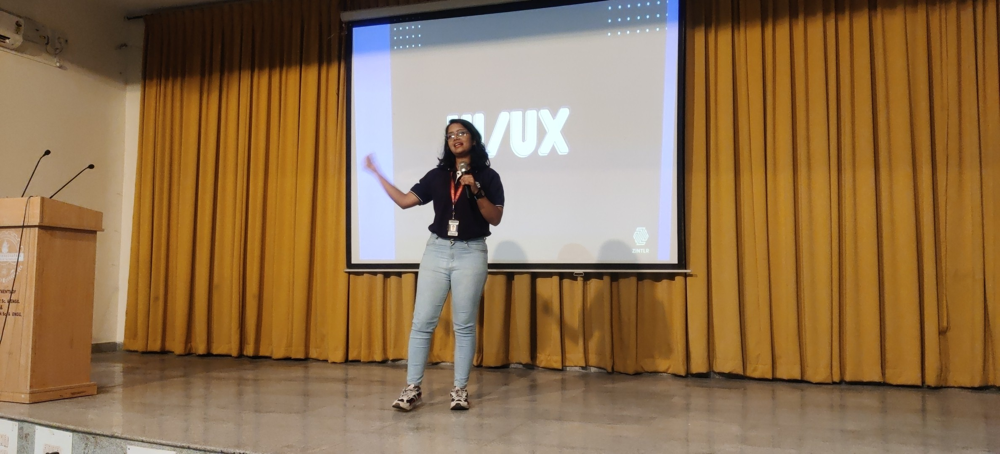
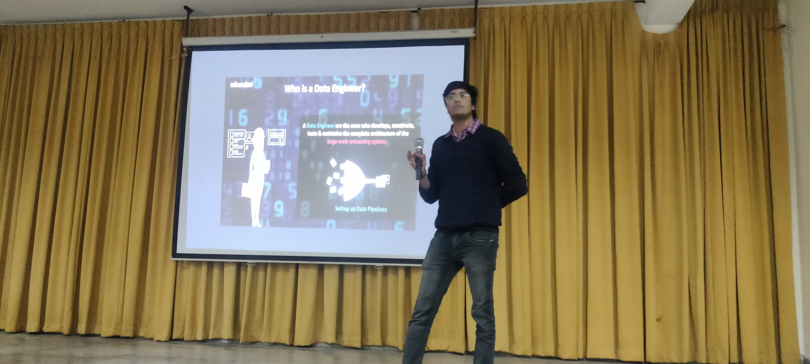
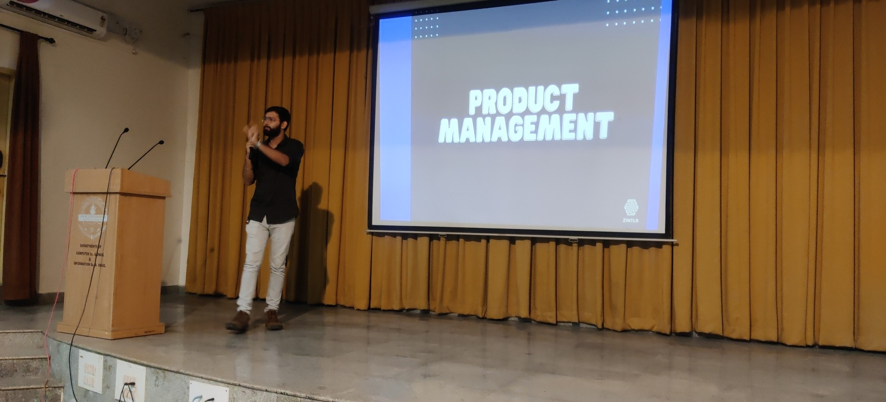
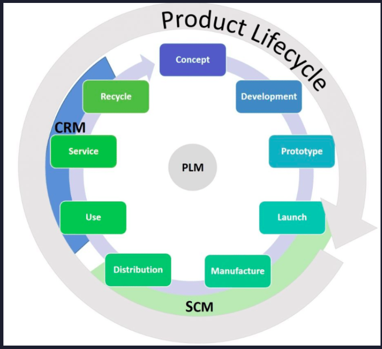
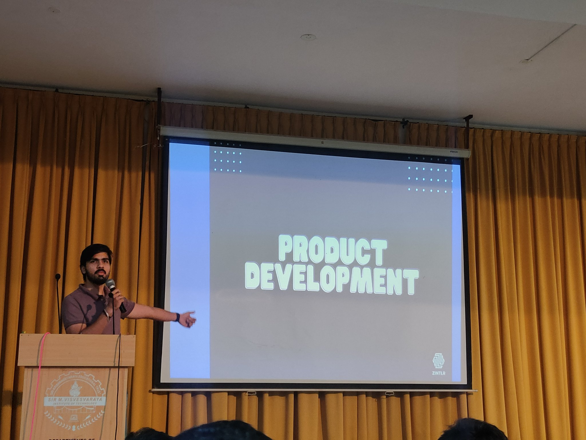
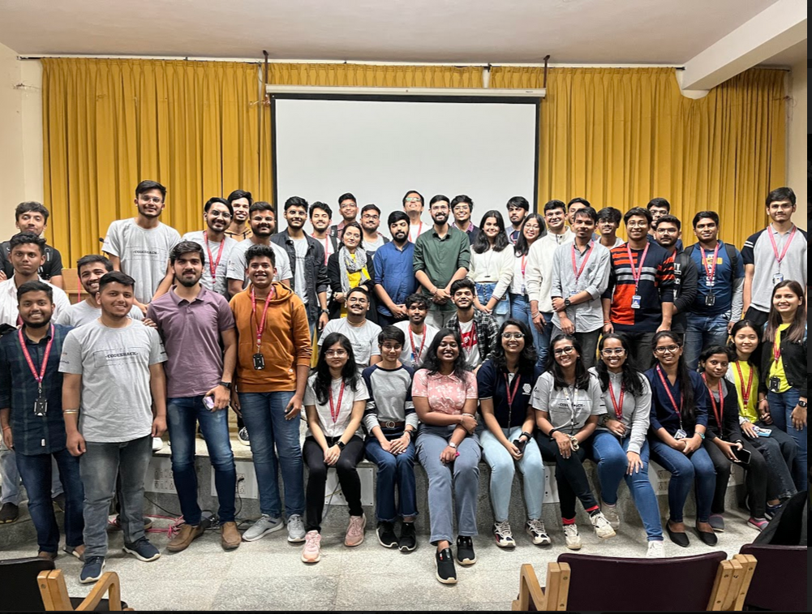

### Hey Folks!!

### Welcome to TechNOva - Innovating minds with thech

TECHNOVA provides you an opportunity to explore the field of Data Engineering, UI/UX , Product Management and Product Developmment.
There will be a session on each topic followed by a quiz . the winners of the quiz will be awarded with cool swags. 
So don’t miss out – come join us on December 13 at CS Seminar Hall to experience a wonderful _tech-ride.

#### Register for the event [Here](https://docs.google.com/forms/d/e/1FAIpQLSeoAN2OVhULewwdozla4BLPxek_fQqrVim8D_DxLwvoNXrxYA/closedform)

## TECHNOVA - INNOVATING MINDS WITH TECH

### Agenda

- Session followed by quiz on UI/UX
- Session followed by quiz on Data Engineeeing
- Session followed by quiz on Product Management
- Session followed by quiz on Product Developmeent
- Any announcements, feedback, QnA.

## Event Details

This is very beginner-friendly event which helps you to know about UI/UX, Data Engineering, Product Management and  Product Development. 

- **Date**:13th December 2022.
- **Time**:1:30 - 4:30 PM

## Speakers:

- **Ujwal Kumar** : Foundr - Zintlr
- **Ravi Jain** : Foundr - Zintlr
- **Pranay Khairwal** : Foundr - Zintlr
- **Shreya Raj** : UI/UX Designer

## The event was held as follows:

# UI/UX 

**speaker: Shreya Raj**

## About UI

The term "UI" stands for User Interface. The user interface is the graphical layout of an application. It consists of the buttons users click on, the text they read, the images, sliders, text entry fields, and all the rest of the items the user interacts with. This includes screen layout, transitions, interface animations and every single micro-interaction. 

## About UX

The term "UX" stands for User Experience. User experience is determined by how easy or difficult it is to interact with the user interface elements that the UI designers have created.

## Salary of a UI/UX Designer

The initial salary of a UI/Ux designer with an experience 0f 0-2 years is 8.25L, which gets increased to 12.7L with 3-5 years of experience. 
The designers with an experience of 6-10 years have an average salary of 22.2L and those with 10-15 years of experience can earn upto 42.04L.
And the designers with 15+ years of experience can earn upto 79.08L. 

## Design Thinking: An iterative Process

Design thinking is a non-linear, iterative process that is used to understand users, challenge assumptions, redefine problems and create innovative solutions to prototype and test. This involves five phases — Empathize, Define, Ideate, Prototype and Test—it is most useful to tackle problems that are ill-defined or unknown.

## The Hook Model

This is a four phase business tactic used to create a high frequency engagement. The four phases are as follows:
1. Trigger : This is the actuator of behavior. It cues the action that then builds a habit.
2. Action : Behaviour executed in the anticipation of reward.
3. Variable Reward : Personal gratification
4. Investment: An action that improves the product or service in the future.

# Data Engineering

**Speaker : Pranay Khairwal**

## **"Data is the new oil"**

## Data Journey

1. **Data Collection** :  The process of curating the required data is known as data collection. There are different methods using which data can be collected. Few of them include surveying, forms, online tracking, interviw, etc.

2. **Data Cleaning** : Data cleaning is the process of fixing or removing incorrect, corrupted, incorrectly formatted, duplicate, or incomplete data within a dataset. When combining multiple data sources, there are many opportunities for data to be duplicated or mislabeled. Therefore data should be cleaned before analising.

3. **Exploratory Data Analysis** : EDA is used to analyze and investigate data sets and summarize their main characteristics, often employing data visualization methods. It helps determine how best to manipulate data sources to get the answers you need, making it easier for data scientists to discover patterns, spot anomalies, test a hypothesis, or check assumptions.

4. **Model Building** : This invoves analizing the data and building the appropriate model   and train the machine.

5. **Model Deployment** : Software deployment is the process of making software available to be used on a system by users and other programs. 

## Who is a Data Analyst?

A data analyst takes data and uses it to help companies make better decisions.

This involves three main steps:
1. Data Collection
2. Data analysis
3. Report genearation

## Who is a Data Engineer?

Data engineer is the one  who designs and builds  systems for collecting, storing, and analyzing data at scale. It is a broad field with applications in just about every industry. Organizations have the ability to collect massive amounts of data, and they need the right people and technology to ensure it is in a highly usable state .

## Who is a Data Scientist?

A data scientist is a professional who deals with the enormous mass of structured/unstructured data and use their skill in maths, statistics and programming. This person visualises the data which is crucial in decision making.

# Product Management

**Speaker : Ujwal Kumar**

## What is Product Management?

Product management is the job of looking after a specific product within a business. It's a most important role of any organisation that needs to balance the need to deliver value to the company (usually profit) with what customers want and what’s technically and operationally possible.

## What does a PM do?

- Analyze customer requirements.
- Market, Competitor, Product Research
- Strategizing plan (development, packaging, launch, scaling)
- Coordinating and communicating with the managers, stakeholders, tems.
- Feedback and improvisation
- Roadmaps, vision and leading teams throughout the product life cycle.

## Skills Required

- Communication Skills
- Strategic thinking
- People management skills
- Design/Technical skills
- User  science and empathy

# Product Development

**Speaker : Ravi Jain**

## What is product development?

Product development typically refers to all stages involved in bringing a product from concept or idea through market release and beyond. In other words, product development incorporates a product’s entire journey.

## Product Lifecycle

The foolowing steps are involved in product lifecycle:

- Concept
- Development
- Prototype
- Launch
- Manufacture
- Distribution
- Use
- Service
- Recycle

## **TECHNOVA RESOURCES** [Here](https://horse-entrance-e86.notion.site/TECHNOVA-Resources-69d95fcf8c394cc995d36451206d6495)

**At the end we want to thank CS Department, specially the Head of Department- Dr. G C Bhanuprakash and Dr. Suma Swamy for helping us conduct this event.**

### Author : Lavanya Lenka

  

